# 👋 Welcome to My GitHub Universe!

<div align="center">


[](https://git.io/typing-svg)

</div>

---

## 🌟 About Me

<div align="center">


</div>

```javascript
const aishwarya = {
    location: "India 🇮🇳",
    currentFocus: "Full Stack Development",
    technologies: ["React", "Node.js", "Python", "JavaScript"],
    hobbies: ["Coding", "Learning", "Open Source"],
    funFact: "I debug with console.log() and I'm proud of it! 😄",
    motto: "Code, Learn, Repeat 🔄"
};
```

<br clear="right"/>

---

## 📊 GitHub Analytics Dashboard

<div align="center">


</div>

<div align="center">


</div>

---

## 🏆 Achievement Collection

<div align="center">


</div>

---

## 🛠️ Technology Arsenal

<div align="center">

### 🎨 Frontend Magic


### ⚡ Backend Power


### 🔧 Tools & Platforms  


</div>

---

## 📈 Contribution Activity

<div align="center">


</div>

---

## 🎯 Current Focus Areas

```mermaid
mindmap
  root((🚀 Growth))
    🌐 Web Development
      ⚛️ React Ecosystem
      🎨 UI/UX Design
      📱 Responsive Design
    🔧 Backend Systems
      🚀 Node.js APIs
      🗄️ Database Design
      ☁️ Cloud Services
    🎓 Learning Path
      🤖 Machine Learning
      📊 Data Structures
      🔐 Cybersecurity
```

<div align="center">



</div>

---

## 🌟 Featured Projects

<div align="center">

<a href="https://github.com/saksenaaishwarya/project1">
  
</a>
<a href="https://github.com/saksenaaishwarya/project2">
  
</a>

</div>

---

## 🎵 Coding Soundtrack

<div align="center">

[](https://spotify-github-profile.vercel.app/api/view?uid=31k6ue3gzb3yts7l3wamyeozwmpy&redirect=true)

</div>

---

## 💭 Random Dev Quote

<div align="center">


</div>

---

## 🤝 Let's Connect & Collaborate!

<div align="center">

[](https://linkedin.com/in/your-linkedin)
[](https://twitter.com/your-twitter)
[](https://your-portfolio.com)
[](mailto:your-email@gmail.com)
[](https://instagram.com/your-instagram)

</div>

---

## 📝 Recent Blog Posts

<!-- BLOG-POST-LIST:START -->
- [Building Scalable React Applications](#)
- [Understanding Async/Await in JavaScript](#)
- [MongoDB Best Practices for Beginners](#)
- [CSS Grid vs Flexbox: When to Use What](#)
<!-- BLOG-POST-LIST:END -->

---

## 🎮 When I'm Not Coding...

<div align="center">

 <em><b>I love connecting with different people</b> so if you want to say <b>hi, I'll be happy to meet you more!</b> 😊</em>

</div>

---

## 📊 Profile Statistics

<div align="center">


[](https://github.com/saksenaaishwarya?tab=followers)
[](https://github.com/saksenaaishwarya)

</div>

---

## 🎯 2024 Goals

- [ ] 🚀 Launch 3 major open-source projects
- [ ] 📚 Master TypeScript and Next.js
- [ ] 🌟 Contribute to 20+ open-source repositories
- [ ] 🎓 Complete AWS certification
- [ ] ✍️ Write 12+ technical blog posts
- [ ] 🤝 Mentor 5+ junior developers

---

<div align="center">

### ✨ "Code is like humor. When you have to explain it, it's bad." ✨

---


**⭐ From [saksenaaishwarya](https://github.com/saksenaaishwarya) with ❤️**

*Thanks for stopping by! Let's build something amazing together! 🚀*

</div>

---

## 🎨 README Inspiration

<details>
<summary>💡 <strong>Want to create your own awesome README?</strong></summary>

### 🛠️ Tools Used:
- [GitHub Readme Stats](https://github.com/anuraghazra/github-readme-stats)
- [GitHub Profile Trophy](https://github.com/ryo-ma/github-profile-trophy)
- [Capsule Render](https://github.com/kyechan99/capsule-render)
- [Typing SVG](https://github.com/DenverCoder1/readme-typing-svg)
- [Activity Graph](https://github.com/ashutosh00710/github-readme-activity-graph)
- [Shields.io](https://shields.io/)

### 📚 Resources:
- [Awesome GitHub Profile READMEs](https://github.com/abhisheknaiidu/awesome-github-profile-readme)
- [GitHub Profile README Generator](https://rahuldkjain.github.io/gh-profile-readme-generator/)

</details>
